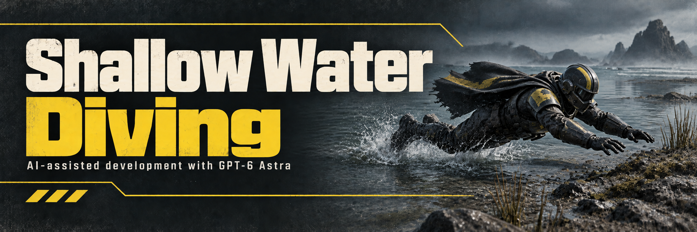

# Shallow Water Diving

A candidate fix for dives that immediately cancel in shallow water. During the airborne dive, the local avatar uses the standing water reference. The normal prone reference returns when landing begins, the dive ends, or deeper water is reached. The intended result is a valid dive from shallow water onto dry land. Ordinary prone input retains the game's existing water restrictions.

**data-v2 gameplay candidate. Requires Bingus Shared Loader loader-v5 / API 1.** Supported Steam build: 24826606; EXE 1.8.45317.0. Offline tests pass; in-game timing and behavior still require validation.

[Bingus Shared Loader](https://github.com/CowboyBingus/BingusSharedLoader) is a separate dependency and is not included in this repository. Use a compatible loader build; an earlier loader will not activate this module.

data-v2 fixes a startup failure in data-v1: the module now waits for native managers and avatar records to initialize instead of permanently stopping on a missing pointer. Replace the gameplay ZIP; an already installed loader-v5 can stay.

Import `ShallowWaterDiving.zip` and the updated `BingusSharedLoader.zip` into Arsenal or HD2MM. With the game closed, enable both and Purge / Deploy. Under Arsenal's default priority, put the loader last. Installation does not require Consistent Vaulting or other gameplay mods.

The package changes two local runtime floats at most: a temporary drowning-reference offset and, when necessary, a one-time reset of the first prone frame's submersion timer. It changes no executable instructions, shared component settings, dive impulse, stamina cost, teammate data, swimming flag or drowning-enable flag.

This candidate must observe the first dive frame before native swimming consumes it. A loaded module is not proof that this scheduling window was reached. `%LOCALAPPDATA%/ShallowWaterDiving.log` records observations, protected launches, startup resets and short dive endings. See [implementation and verification](docs/TECHNICAL.md).

Formerly **Shallow Water Dive**. The mod-manager ID and loader resource name remain unchanged, so replace the old package rather than enabling both.

Build with `python -B scripts/build.py`. The output is `releases/ShallowWaterDiving.zip`. Building does not install or launch the game. See [build instructions](CONTRIBUTING.md).

[Release notes](docs/RELEASE_NOTES.md) · [Privacy review](docs/PRIVACY.md) · [Artwork](assets/ARTWORK.md)

Developed with assistance from GPT-6 Astra.
